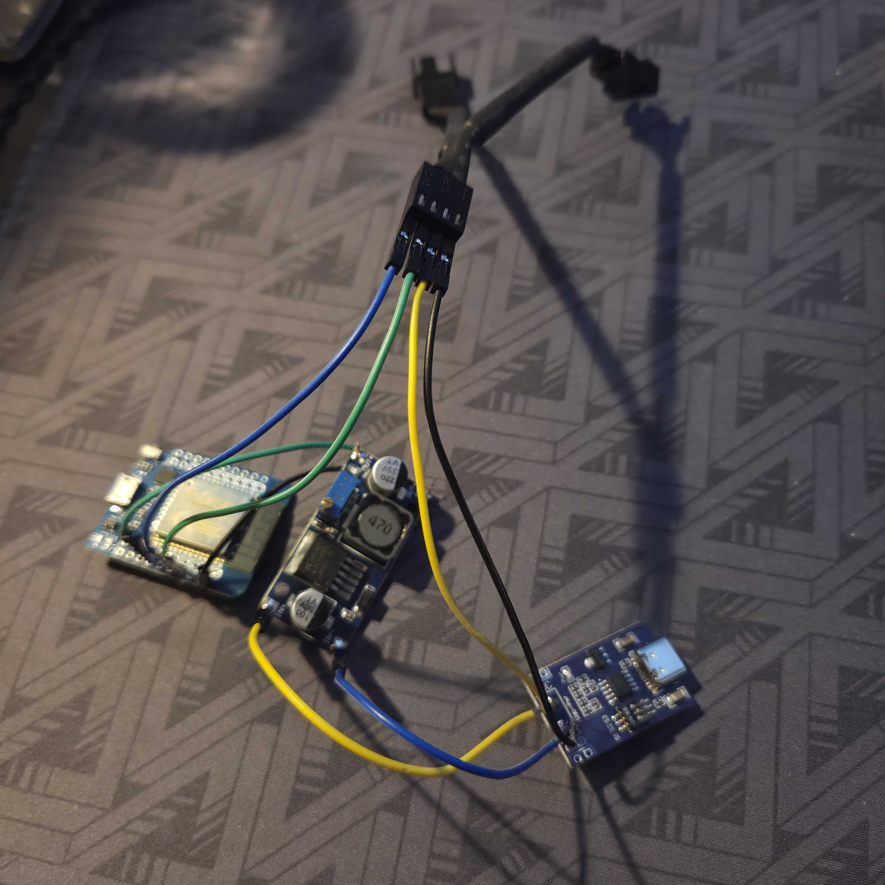

# Laptop cooler controller

Bare-metal Rust firmware for a PWM-controlled laptop cooler. The complete Xtensa Rust toolchain runs in Docker; Rust, `espup`, and `espflash` are not installed on the host.

## v0.1.0

This may be the worst soldering job i have ever done, but necessity is the mother of all invention(or in this case abominations), and it works so :shrug: 



## Hardware target

- AZDelivery ESP32 D1 Mini (`wemos_d1_mini32`)
- Noctua NF-A12x15 PWM chromax.black.swap 4-wire fan
  - 12 V supply, 0.13 A / 1.56 W maximum
  - 0–1850 RPM; 0 RPM at 0% PWM and approximately 450 RPM at 20%
  - 25 kHz PWM target (21–28 kHz accepted)
  - Open-collector tach output with two pulses per revolution
- Fan powered from the 12 V USB-C PD trigger output
- ESP32 powered through the buck converter
- Fan PWM connected to ESP32 IO32 and generated at 25 kHz
- Fan tach connected to ESP32 IO27 with its internal pull-up enabled
- Common ground between the PD trigger, fan, buck converter, and ESP32

Do not connect the fan supply voltage to an ESP32 GPIO. Confirm the fan and PD-trigger voltage ratings before applying power.

## Prerequisites

- Docker with the Compose plugin
- ESP32 connected through its CP2102 Micro-USB serial interface

The wrapper maps only the detected serial device into the container. It runs Cargo as the host UID and adds the serial device's group dynamically, so host serial-group membership is not required.

## Commands

```bash
./dev build
./dev upload
./dev monitor
```

Flash and immediately monitor at 115200 baud:

```bash
./dev upload-monitor
```

Other commands:

```bash
./dev clean
./dev info
./dev shell
```

The image contains the pinned Espressif Xtensa compiler and `espflash`. Cargo dependencies and build artifacts are stored in the project-local `.cache` directory and reused by later builds.

If automatic serial detection fails, provide a device explicitly:

```bash
SERIAL_DEVICE=/dev/ttyUSB1 ./dev upload
```

## Fan-test firmware

The `no_std` firmware drives IO32 at 25 kHz and 50% duty. It polls the IO27 tach signal, counts falling edges, and reports RPM once per second using the fan's two-pulses-per-revolution specification.

With no fan connected, the expected output is zero pulses and zero RPM. Before connecting the fan directly to IO32, verify that its disconnected PWM pin does not rise above the ESP32's 3.3 V GPIO limit when fan power is applied.
