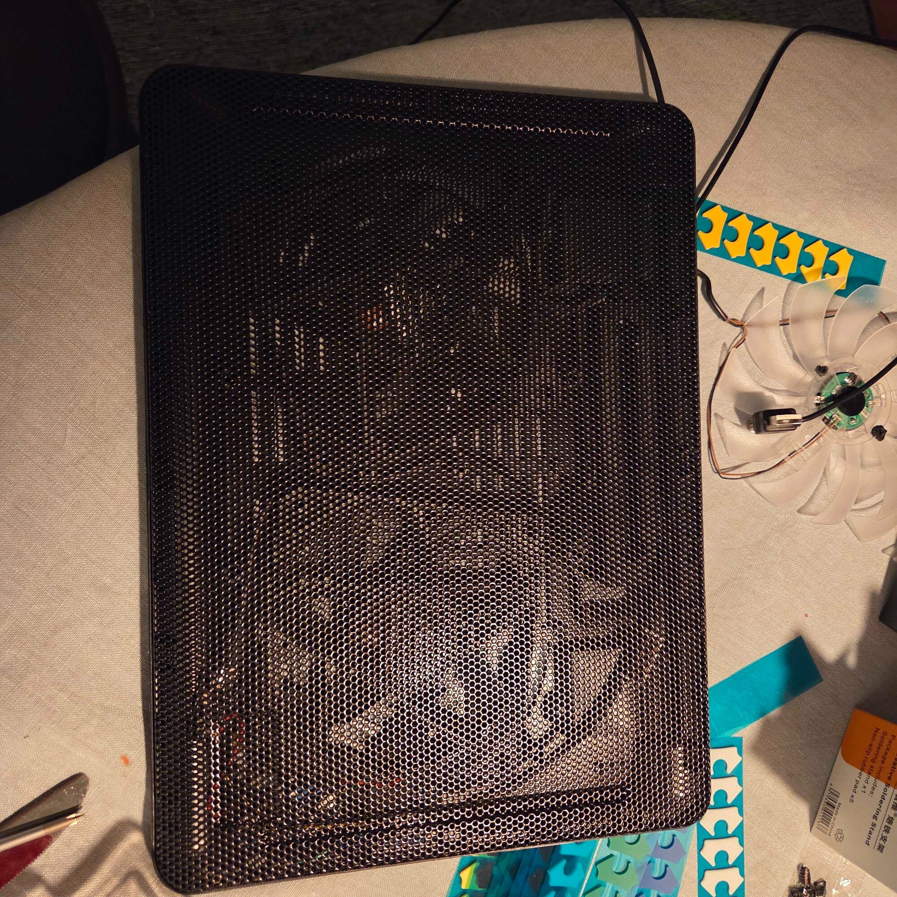

# Laptop cooler controller

ESP32 firmware and a Linux temperature agent for a supplemental PWM-controlled laptop cooler. The host computes a configurable fan policy; the ESP32 applies requested PWM duty and shuts the accessory fan down when the host is absent.

## Finished build



Original controller wiring:


## How it works

1. The Linux agent reads supported CPU and GPU sensors from `/sys/class/hwmon` and uses the highest temperature.
2. It smooths the temperature, evaluates the configured fan curve, applies hysteresis and asymmetric slew, then broadcasts an authenticated command once per second.
3. The ESP32 validates the token, sequence, temperature, and requested duty before updating its 25 kHz PWM output.
4. The ESP32 holds the last duty through brief communication loss, then stops the accessory fan after 60 seconds without a host command. A reported temperature at or above 90 °C still forces 100% during that cooldown.

## Hardware

- AZDelivery ESP32 D1 Mini (`wemos_d1_mini32`)
- Noctua NF-A12x15 PWM chromax.black.swap 4-wire fan
  - 12 V supply, 0.13 A / 1.56 W maximum
  - 0–1850 RPM; 0 RPM at 0% PWM and approximately 450 RPM at 20%
  - 25 kHz PWM target and two tach pulses per revolution
- 12 V USB-C PD trigger output for the fan
- Buck converter adjusted to 5 V for the ESP32
- ESP32 IO32 to fan PWM
- ESP32 IO27 to fan tach
- Common ground between the PD trigger, fan, buck converter, and ESP32

Do not connect fan supply voltage to an ESP32 GPIO. Do not power the controller from the buck converter and laptop Micro-USB simultaneously.

## Firmware installation

Prerequisites:

- Docker with the Compose plugin
- ESP32 connected through its CP2102 Micro-USB interface
- USB-C/PD power disconnected while laptop Micro-USB is connected

Build and flash:

```bash
./dev build
./dev upload
```

Open a non-interactive serial log:

```bash
./dev monitor-log
```

Other commands:

```bash
./dev upload-monitor
./dev monitor
./dev clean
./dev info
./dev shell
```

The wrapper detects the serial device, maps only that device into Docker, and runs the pinned Espressif Xtensa toolchain in the container. Override detection when necessary:

```bash
SERIAL_DEVICE=/dev/ttyUSB1 ./dev upload
```

## Wi-Fi setup

With no valid stored configuration—or after a bounded station connection failure—the controller starts:

- SSID: `LaptopCooler-Setup`
- Password: `cooler-setup`
- Setup page: `http://192.168.4.1/`

Enter a 2.4 GHz Wi-Fi SSID, its password, and a private 16–32 character control token. The token accepts letters, numbers, underscores, and hyphens. The controller verifies the journaled flash write before rebooting.

After joining the configured network, it listens for control commands on UDP port `42110`.

## Linux temperature agent

Install the binary and systemd user unit:

```bash
host-agent/install.sh
```

Edit the generated configuration and set the same private token used by the setup portal:

```bash
$EDITOR ~/.config/laptop-cooler/config
```

Test one command, then enable the service:

```bash
~/.local/bin/laptop-cooler-agent --once
systemctl --user enable --now laptop-cooler-agent.service
```

Inspect it with:

```bash
systemctl --user status laptop-cooler-agent.service
journalctl --user -u laptop-cooler-agent.service
```

The agent supports `amdgpu`, `coretemp`, `i915`, `k10temp`, `nvidia`, `nouveau`, and `zenpower` hwmon devices.

## Fan-policy configuration

Default configuration:

```ini
token=replace_with_your_token
curve=45:25,55:40,65:60,75:80,80:100
smoothing_seconds=5
duty_step_percent=5
duty_hysteresis_percent=5
ramp_up_percent_per_second=10
ramp_down_percent_per_second=2
emergency_temperature_c=80

# Optional transport overrides:
# destination=255.255.255.255:42110
# interval_ms=1000
```

`curve` is a comma-separated list of `temperature_C:duty_percent` points. Temperatures and duties must increase, duties must remain between 20% and 100%, and the curve must end at 100% no later than the configured emergency temperature.

| Setting | Purpose | Valid range |
| --- | --- | --- |
| `smoothing_seconds` | Dampens short sensor spikes before evaluating the curve | 0–60 s |
| `duty_step_percent` | Quantizes commanded duty into stable increments | 1–20 percentage points |
| `duty_hysteresis_percent` | Required duty difference before selecting a new target | 0–20 percentage points |
| `ramp_up_percent_per_second` | Maximum normal increase rate | 1–100%/s |
| `ramp_down_percent_per_second` | Maximum decrease rate | 1–100%/s |
| `emergency_temperature_c` | Immediately requests 100% without smoothing or slew | 50–90 °C |
| `interval_ms` | Sensor and heartbeat interval | 250–60000 ms |

Apply changes without reflashing:

```bash
systemctl --user restart laptop-cooler-agent.service
```

The host settings cannot disable the ESP32's command limits: requests outside 20–100% are rejected and reported temperatures at or above 90 °C force 100%. If communication stops, the ESP32 holds the last effective duty for a 60-second cooldown and then stops the supplemental fan at 0%. Booting without a host command also leaves the fan off.

## Control protocol

The agent broadcasts an ASCII LC2 packet:

```text
LC2 <token> <sequence> <temperature_milli_c> <requested_duty_percent>
```

The sequence number prevents duplicate and out-of-order commands. A new sequence epoch is accepted after five seconds without a valid packet, allowing clean host-agent restarts without ending the 60-second duty cooldown.
